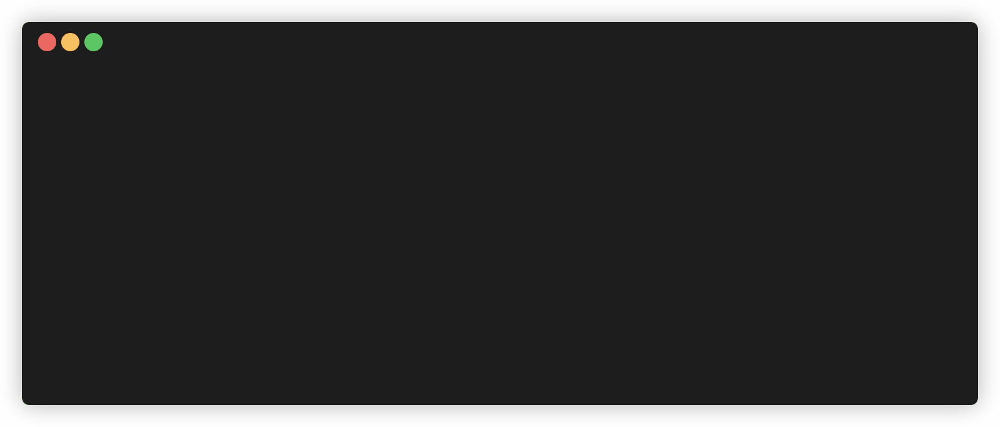

# Guard an Autonomous Agent with Deny-by-Default Policies and Lifecycle Hooks

**In this codelab you put deny-by-default safety policies and lifecycle hooks on an autonomous Antigravity SDK agent**, so it cannot read production secrets, rewrite applied migrations, or run destructive cluster deletes — every tool call is intercepted, audited, blocked, or rewritten before it runs.

Put runtime guardrails on an autonomous agent working in a mock release repo,
using the **Antigravity SDK** (Python). A deny-by-default policy and lifecycle
hooks intercept every tool call **before it runs**: raw shell is disabled, reads
of sealed secrets and edits of migrations are denied with a reason, a curated
`kubectl` tool rewrites a destructive `delete` into `--dry-run=client`, and a
post-tool hook audits everything the agent did.

**▶️ Start the codelab:** https://happycode.studio/gde-sprint-26-guardrails-public/

## What you'll build

A release repo an agent can work in safely — the guard denies the dangerous calls
with a reason, allows the benign ones, and rewrites the risky-but-useful command,
all verified offline and confirmed with a live agent run:



## Get the starter files

This repo also hosts the published codelab, so you don't need the whole thing.
Pull down just the `workspace/` folder with a sparse checkout — that folder is
your working directory, no copy step needed:

```bash
git clone --no-checkout --depth 1 https://github.com/evanca/gde-sprint-26-guardrails-public.git
cd gde-sprint-26-guardrails-public
git sparse-checkout init --cone
git sparse-checkout set workspace
git checkout
cd workspace
```

- `workspace/` — the mock release console (your working directory): services,
  flags, migrations, and masked secrets in local JSON, plus `guard/` where the
  deny-by-default policy lives. `guard/policy.py` starts as a stub (the offline
  tests are red); you implement it, then run a live agent against the guard.
- [`reference/`](./reference) — the completed end state, for comparison if your
  result differs.

The policy logic is pure Python and verified offline with
`python -m unittest discover -s tests -p "test_*.py"` — no SDK or agent run
needed. Running the live agent needs the Antigravity SDK and credentials (a
Gemini API key, or a Google Cloud project via Vertex AI).

Follow the [codelab](https://happycode.studio/gde-sprint-26-guardrails-public/)
from here.

---

Google Cloud credits were provided for this project as part of the Agentic Architect Sprint 2026.

#AgenticArchitect #GoogleAntigravity
